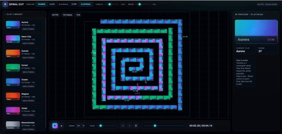
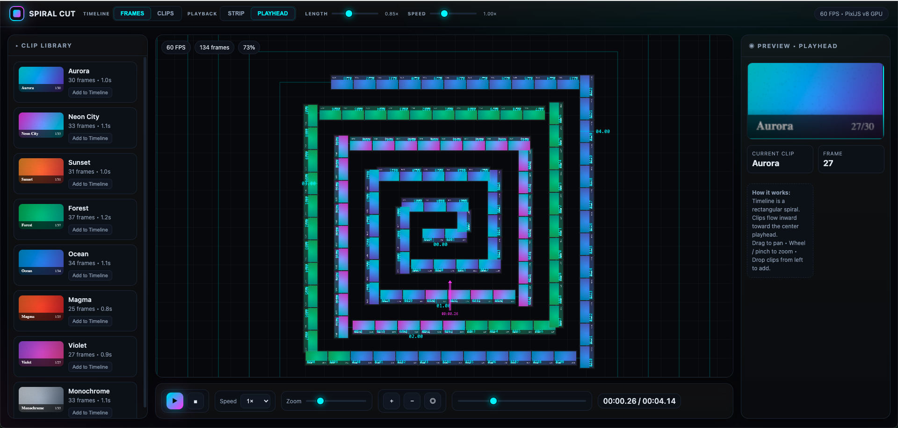

Spiral Edit - video editor

This is the beginning code sketch for a video
editor where the timeline is arranged in the form
of a rectangular spiral instead of a horizontal track. 
The playhead moves around the spiral starting
from the center, which is the beginning of the timeline.
The user makes use of the space through zooming in
and out (with the scrollwheel or pressing the
z key to activate a zoom line) and panning just
like any zoomable workspace (e.g. CAD).

In the future it will be important 
how to let the user adjust what is viewed on
the spiral so that the segments of the spiral or
the center are always showing the right amount of information
and if the user wants to view only a certain scene
on the spiral to work on it, it can load just that scene.  
It is expected that the workspace that currently contains just one spiral 
will contain multiple clips and views for the project 
sequence/timeline, including a timeline that is
grid/table that is row major.  The zoom environment
allows for many alternative kinds of timelines and sequencers

Because of the expanded view provided for browsing 
the video sequence, two types of timelines are provided: 
frames and clips.  Frames is all of the frames of 
the video(s).  Clips is the clips as they are
shown now in a video editor timeline.

A zoomable, pannable workspace as well
a rectangular spiral UI provides a lot of
benefits for navigating and editing videos,
first because it removes fatigue of having to
seek to the desired location on a horizontal timeline.
On a horizontal timeline, only a portion of 
the entire sequence of videos can be
viewable. 

As is the case when the situation changes,
it opens up opportunities for different video
editing conventions, such as making a second 
vide preview box underneath the
playhead preview box which is one that updates
based on where the mouse hovers. That wouldn't
have as much use on a conventional horizontal
timeline.

A horizontal timeline is natural 
for physical film editing but in those circumstances
the film is handled physically by the person. 
When the computer display is available, film editing
should be adapted to its capabilities, namely
the ability to zoom in and out. This also demonstrates
the importance of changing the interactive
form of a technology and adapting it
when the conditions have changed.  

